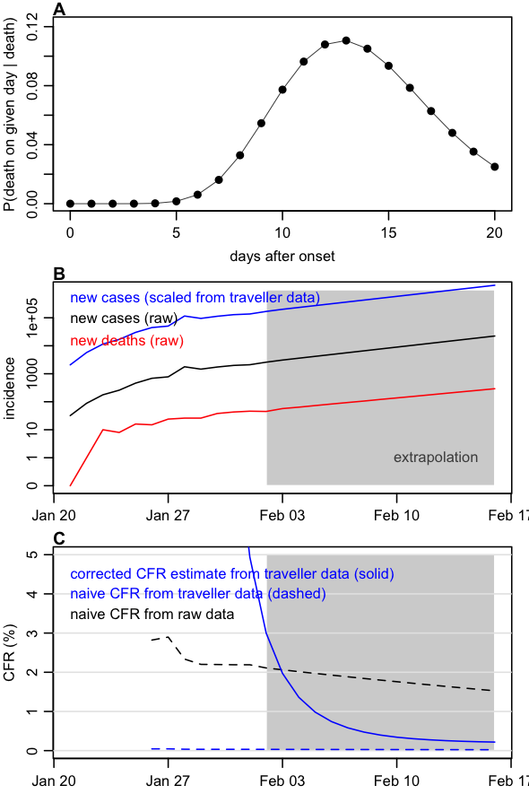

```{r setup, include=FALSE}
knitr::opts_chunk$set(echo = FALSE)
```

*Contributors: Tim Russell, CMMID nCoV working group, Adam Kucharski.*

*Note: this is preliminary analysis and has not yet been peer-reviewed.*

## Aim

To estimate the case fatality rate for nCoV based on available data on cases and deaths.

## Methods summary

• We used the same method as in our [Ebola letter](https://www.thelancet.com/journals/lancet/article/PIIS0140-6736(14)61706-2/fulltext), which estimated a [corrected CFR](https://journals.plos.org/plosone/article?id=10.1371/journal.pone.0006852) accounting for delay to known outcome, rather than using a naive cases/deaths calculation. We assumed a 13.8 day onset-to-death for nCoV ([Linton et al pre-print](https://www.medrxiv.org/content/10.1101/2020.01.26.20018754v1) ). Distribution shown in Figure 1A.

• We only have decent total incidence estimates from 16th Jan onwards (Figure 2B), so if the delay is almost two weeks, we're now just getting to the point where we can calculate outcomes from this period (because otherwise the death outcomes will include missing incidence prior to 16th Jan). To get around this, we did a rough linear extrapolation on log(cases) over the past 7 days to generate some more data points for the following two weeks. (Note: this is not really a forecast, it's just to see what the converged CFR might look like).

• The 'corrected CFR' based on the raw counts was implausibly large because there have been a hundred or so deaths in the past week, but there were only a couple of hundred cumulative cases 12 days ago (when these deaths would have had onset on average).

• So instead we looked at estimated CFR when case numbers are scaled up based on our relative reported estimates from Wuhan = factor of ~65 (for comparison, the Wu et al Lancet analysis produced a factor of ~100). We assumed all deaths were reported as in the raw data.

## Key results

• Using case data scaled for reporting compared to that for exported cases, we obtained an adjusted CFR estimate that was declining as more data came in. **Extrapolating current growth of cases and deaths, we'd expect the cCFR estimate to coverge to around 0.2% in the next couple of weeks (Figure 1C, solid blue line).**.

```{r fig_inference, echo=FALSE, fig.align='center', fig.cap="_Figure 1: Case fatality estimate. A) Assumed distribution of onset-to-death in cases with fatal outcomes. B) Incidence of new cases, new deaths and cases adjusted based on scaling factor estimated from exported cases. C) Estimate CFR using raw data and a naive calculation; traveller scaled data and naive calculation; traveller scaled data and a corrected calculation_", out.width = '40%'}

```
