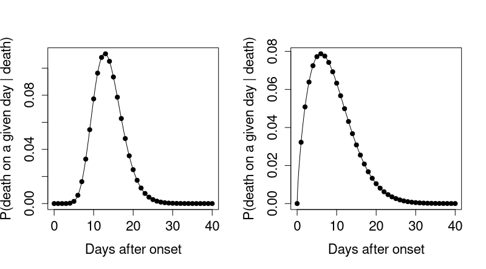
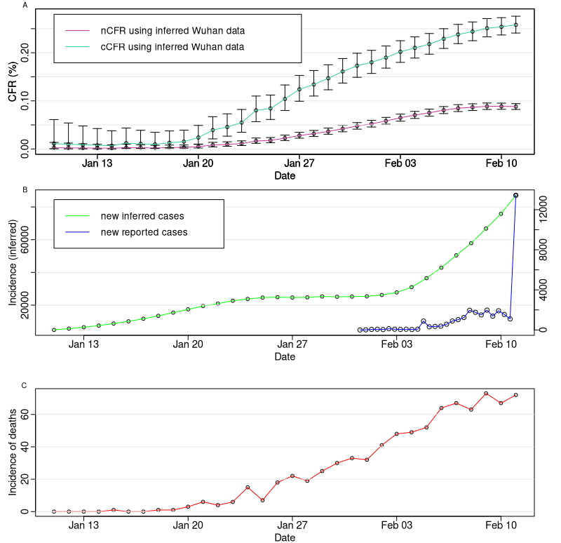
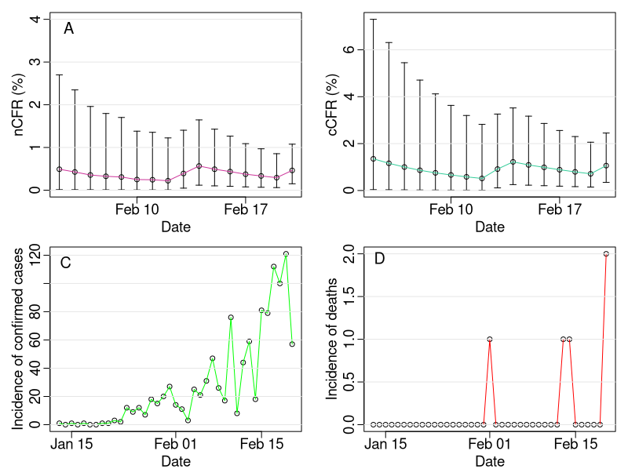
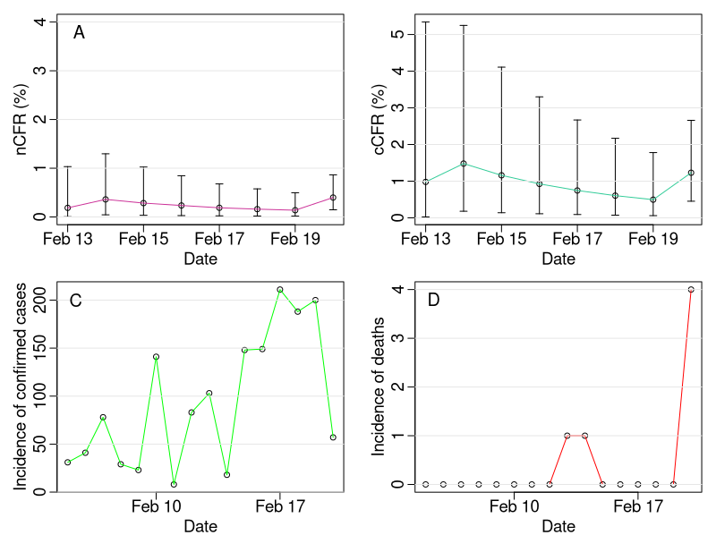

```{r setup, include=FALSE}
knitr::opts_chunk$set(echo = FALSE)
```

*Contributors: Timothy W. Russell, Yang Liu, Charlie Diamond, CMMID COVID-19 working group, W. John Edmunds, Adam J. Kucharski.*

*Note: this is preliminary analysis and has not yet been peer-reviewed.*

## Aim

To accurately estimate the case fatality ratio (CFR) of COVID-19 using multiple available datasets, including the fitted output of [Kucharski et al.](https://www.medrxiv.org/content/10.1101/2020.01.31.20019901v2.full.pdf+html) as a more accurate incidence case data for Wuhan.

## Methods summary

• We correct for the inherent biases in its estimation when calculated during an ongoing epidemic. The [corrected CFR](https://journals.plos.org/plosone/article?id=10.1371/journal.pone.0006852) - equation (6) - used scales the CFR estimate by accounting for outcomes which are unknown at the time in question, but given known information about delay distributions, can be estimated. This the same method used in our [Ebola letter](https://www.thelancet.com/journals/lancet/article/PIIS0140-6736(14)61706-2/fulltext).

• We perform these corrections on multiple datasets of different types: real death data for Wuhan, [inferred case data](https://www.medrxiv.org/content/10.1101/2020.01.31.20019901v2.full.pdf+html) for Wuhan and real international case and death data. 

• The inferred data is used to attempt to correct for reporting biases in Wuhan, as the underlying [model](https://www.medrxiv.org/content/10.1101/2020.01.31.20019901v2.full.pdf+html) fits to multiple datasets.

• However, as the death data is far more reliable, we use the real death time series from within Wuhan within the calculation.

• We assumed a mean of 13.8 days onset-to-death for COVID-19 ([Linton et al. ](https://www.medrxiv.org/content/10.1101/2020.01.26.20018754v1)). The onset-to-death distribution is shown in Figure 1A.

• We also assumed a mean of 8.9 days from hospitalisaton-to-death for COVID-19 ([Linton et al. ](https://www.medrxiv.org/content/10.1101/2020.01.26.20018754v1)). The hospitalisation-to-death distribution is shown in Figure 1B.


```{r fig_distribution, echo=FALSE, fig.align='center', fig.cap="_Figure 1: Delay distributions A) Assumed distribution of onset-to-death in cases with fatal outcomes - Gamma distribution with mean of 13.8 days and scale parameter equal to 1. B) Assumed distribution of hospitalisation to death in cases with fatal outcomes - Weibull distribution with mean of 8.9 days and standard deviation of 5.4 days._", out.width = '80%'}

```


## Key results

## Table of most recent results

| Dataset | Date of estimate |  nCFR    | cCFR | Distribution |
| ----------- | ----------- | ----------- | ----------- | ----------- |
| Wuhan data | 11th February | 0.0881% (0.00821%-0.0943%) | 0.258% (0.241%-0.276%)| onset-to-death (Figure 1A) |
| International data excluding cruise ship | 20th February | 0.463% (0.150%-1.077%)  | 1.060% (0.3440%-2.45%) | hospitalisation-to-death (Figure 1B) |
| International data including cruise ship | 20th February | 0.398% (0.146-0.864%) | 1.230% (0.453-2.66%) | hospitalisation-to-death (Figure 1B) |
| Cruise ship only| 20th February | 0.327% (0.0397%-1.177%) | 1.04% (0.126%-3.71%) | hospitalisation-to-death (Figure 1B) |

### Wuhan cCFR estimates


```{r fig_inferred, echo=FALSE, fig.align='center', fig.cap="_Figure 2: Case fatality estimate for Wuhan. A) Both the naive CFR and corrected CFR for Wuhan, using inferred case data but real death data. B). the inferred and real incidence case data used to calculate the CFR estimates. C). The real death data used to calculate the CFR estimates._", out.width = '70%'}

```

### cCFR estimates using only confirmed international cases, excluding Iran, Hong Kong, Taiwan and the cruise ship data

```{r fig_internatonal, echo=FALSE, fig.align='center', fig.cap="_Figure 3: Case fatality estimates using only international data (excluding Iran, Hong Kong, Taiwan and the cruise ship data). A) Naive CFR estimates using only international case and death incidence data. B) Corrected CFR estimates using only international case and death incidence data. C) The case incidence data used to calculate the CFR estimates. D). The death incidence data used to calculate the CFR estimates._", out.width = '70%'}

```

### cCFR estimates using only confirmed international cases, including cruise ship data

```{r fig_international_cruise, echo=FALSE, fig.align='center', fig.cap="_Figure 4: Case fatality estimates using international data and the Diamond Princess cruise ship data (excluding Iran, Hong Kong and Taiwan). A) Naive CFR estimates using only international case and death incidence data. B) Corrected CFR estimates using only international case and death incidence data. C) The case incidence data used to calculate the CFR estimates. D). The death incidence data used to calculate the CFR estimates._", out.width = '70%'}

```


### Detailed methods

• We use the inferred incidence case data from our fitted model of the dynamics of the outbreak in Wuhan (a  short report of the model can be found [here](https://cmmid.github.io/ncov/wuhan_early_dynamics/index.html) and the preprint of the corresponding ful manuscript can be found [here](https://www.medrxiv.org/content/10.1101/2020.01.31.20019901v1)).

• Using this inferred data, we can somewhat account for the biases in the rate of accurate reporting insofar as cases might be under or over reported for various reasons. We do so by fitting an outbreak model to multiple datasets giving more accurate case numbers. Details for how this is achieved in the outbreak model are in the [supplementary material for the preprint](https://www.medrxiv.org/content/10.1101/2020.01.31.20019901v1)).

• For the Wuhan estimates, we use the onset-to-death distribution to calculate the delay.

• For the international estimates, as the data is by date of confirmation, we use the hospitalisation-to-death distribution.

