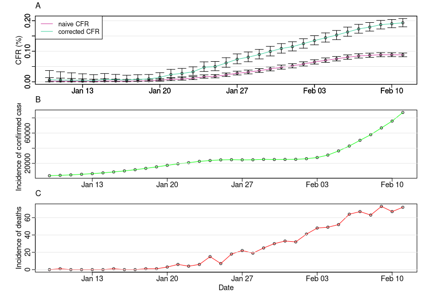
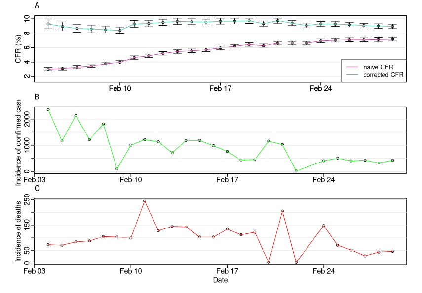
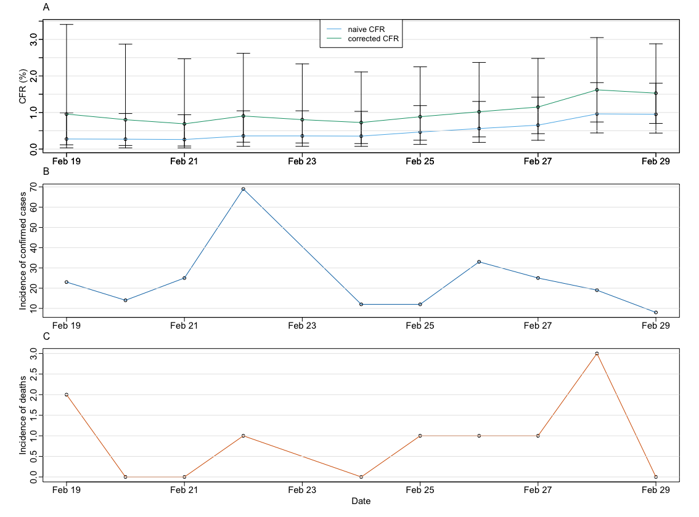
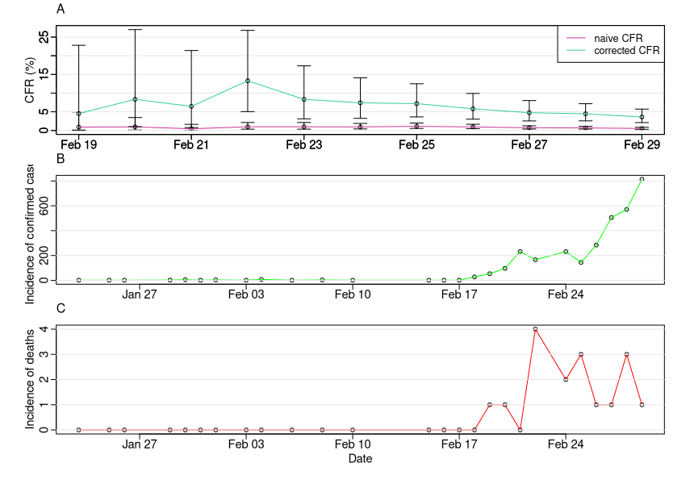
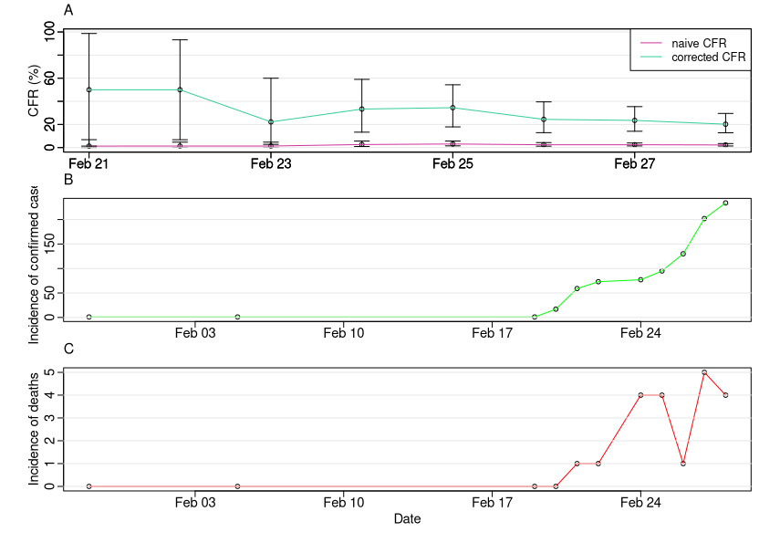

```{r setup, include=FALSE}
knitr::opts_chunk$set(echo = FALSE)
```

*Contributors: Timothy W. Russell, Yang Lui, Sam Abbott, Hamish Gibbs, Christopher I Jarvis, Kevin Van Zandvoort, Joel Hellewell, Amy Gimma, CMMID nCoV working group, Rosalind M Eggo,  W John Edmunds, Adam J Kucharski*

*Note: this is preliminary analysis and has not yet been peer-reviewed.*

## Aim

To estimate the case fatality ratio (CFR) of COVID-19, we used multiple available datasets, including the output of [Kucharski et al.](https://www.medrxiv.org/content/10.1101/2020.01.31.20019901v2.full.pdf+html) that accounted for under-reporting in Wuhan. 

## Key results

### Diamond Princess Cruise Ship data

We calculated infection and case fatality rate, adjusting for delay from reporting-to-death (assumed to be equivalent to hospitalisation-to-death). Truncated values accounted for right-censoring in the [Linton et al. ](https://www.medrxiv.org/content/10.1101/2020.01.26.20018754v1) dataset. The age distribution of people on the ship is given in Figure 3 below.

| Age Range | cIFR | cCFR | Distribution |
| ----------- | ----------- | ----------- | ----------- |
| All ages combined | 0.909% (0.11% - 4.26%) | 1.85% (0.601% - 4.282%) | hospitalisation-to-death non-truncated (Figure 2A) |
|        |1.18% (0.383% - 2.72%) | 2.30% (0.746% - 5.295%) | hospitalisation-to-death truncated (Figure 2B) |

We also calculated CFR specific to individuals in the 80-89 age group, in which four deaths have been reported. 

| Age Range | cIFR | cCFR | Distribution |
| ----------- | ----------- | ----------- | ----------- |
| 80 - 89 | 11.1%  (3.71% - 24.1%) | 21.6% (7.22% - 46.9%) | hospitalisation-to-death non-truncated (Figure 1B) |
|     | 13.9%  (4.67% - 29.5%) | 27.1% (9.09% - 57.42%) | hospitalisation-to-death truncated (Figure 1B) |


### Summary table of cCFR estimates stratified by location

As the outbreak in Italy is very recent, their data is heavily left and right censored, which is reflected heavily in their unrealistically high CFR estimate.

| Dataset | Date of estimate| cCFR | Distribution |
| ----------- | ----------- | ----------- | ----------- | 
| Wuhan data (estimated cases) | 11th February | 0.248% (0.231%-0.266%) | onset-to-death non-truncated (Figure 1A) |
|     |     | 0.326% (0.304%-0.349%) | onset-to-death truncated (Figure 1B) |
| Japan | 29th February | 1.26% (0.579%-2.38%) | hospitalisation-to-death non-truncated (Figure 1A) |
|     |     | 1.53% (0.701%-0.2.88%) | hospitalisation-to-death truncated (Figure 1B) |
| South Korea | 29th February | 2.71% (1.59%-4.31%) | hospitalisation-to-death non-truncated (Figure 2A) |
|     |     | 3.62% (2.12%-5.73%) | hospitalisation-to-death truncated (Figure 2B) |
<!--- | Italy | 29th Feburary | 14.8% (9.29%-21.9%) | hospitalisation-to-death (Figure 2B) | --->
<!--- |    |     | 20.2% (12.8%-29.5%) | hospitalisation-to-death truncated (Figure 2B) | --->
 
 
### Wuhan Data stratified by age range

We adjusted estimates for the age distribution of cases and deaths in Wuhan

| Age Range | cCFR | Distribution |
| ----------- | ----------- | ----------- |
| 0 - 29  | NA | NA |
| 30 - 49 | 0.0248% (0.0180% - 0.0333%) | onset-to-death non-truncated (Figure 1A) |
| 30 - 49 | 0.0296% (0.0215% - 0.0398%) | onset-to-death truncated (Figure 1B) |
| 50 - 59 | 0.0934% (0.0764% - 0.113%)  | onset-to-death non-truncated (Figure 1A) |
| 50 - 59 | 0.111%  (0.0912% - 0.135%)  | onset-to-death truncated (Figure 1B) |
| 60 - 69 | 0.240%  (0.211%  - 0.273%)  | onset-to-death non-truncated (Figure 1A) |
| 60 - 69 | 0.287%  (0.252%  - 0.326%)  | onset-to-death truncated (Figure 1B) |
| 70 - 79 | 0.543%  (0.478%  - 0.613%)  | onset-to-death non-truncated (Figure 1A) |
| 70 - 79 | 0.648%  (0.571%  - 0.733%)  | onset-to-death truncated (Figure 1B) |
| 80 -    | 0.904%  (0.774%  - 1.050%)  | onset-to-death non-truncated (Figure 1A) |
| 80 -    | 1.080%  (0.924%  - 1.250%)  | onset-to-death truncated (Figure 1B) |


### Table of crude upper bound estimates

In countries without any deaths yet, we also estimated crude upper bounds for the CFR by finding the total number of recovered individuals, N, and using the rule of three (i.e. 3/N to give the upper 95% CI). These estimates are crude approximations and are only within the right area if enough individuals have recovered. Therefore, in countries outside of Singapore where no deaths have occurred, we sum up the recovered individuals to get these estimates.

| Country | Recovered | Crude upper bound |
| ----------- | ----------- | ----------- | 
| Singapore | 58 | 5.17% |
| All countries (without singapore) | 117 | 2.564% |
| All countries | 175 | 1.71% |

```{r fig_distribution_onset, echo=FALSE, fig.align='center', fig.cap="_Figure 1: Delay distributions of onset-to-death in cases with fatal outcomes - both are Lognormal distribution fits taken from Linton et al. A). Non-truncated distribution, mean of 14.5 days and SD of 6.7 days. B). Right-truncated distribution of onset-to-death, mean of 20.2 days and SD of 11.6 days._", out.width = '80%'}
knitr::include_graphics("../plots/onset_to_death_delays.png")
```

```{r fig_distribution_hosp, echo=FALSE, fig.align='center', fig.cap="_Figure 2: Delay distributions of hospitalisation-to-death in cases with fatal outcomes - both are Lognormal distribution fits taken from Linton et al. A). Non-truncated distribution, mean of 8.6 days and SD of 6.7 days. B). Right-truncated distribution of hospitalisation-to-death, mean of 13 days and SD of 12.7 days._", out.width = '80%'}
knitr::include_graphics("../plots/hospitalisation_to_death_delays.png")
```

### Age distribution on cruise ship

We plot the distribution of ages on the Diamond Princess cruise ship taken from [this paper](https://www.niid.go.jp/niid/en/2019-ncov-e/9417-covid-dp-fe-02.html). We use this age distribution to calculate age stratified cCFR estimates.


```{r fig_distribution_ages, echo=FALSE, fig.align='center', fig.cap="_Figure 3: The age distribution of individuals on the Diamond Princess cruise ship._", out.width = '80%'}
knitr::include_graphics("../plots/age_distribution.png")
```


## Time-series of the CFR estimates

### Wuhan estimates

```{r fig_wuhan_TS, echo=FALSE, fig.align='center', fig.cap="_Figure 4: A). The nCFR and cCFR estimates for Wuhan plotted against time. B). The inferred case incidence data from  [Kucharski et al.](https://www.medrxiv.org/content/10.1101/2020.01.31.20019901v2.full.pdf+html). C). The real death incidence data._", out.width = '80%'}

```

### China estimates

```{r fig_china_TS, echo=FALSE, fig.align='center', fig.cap="_Figure 5: A). The nCFR and cCFR estimates for China plotted against time. B). The case incidence data. C). The death incidence data._", out.width = '80%'}

```

### Japan estimates

```{r fig_japan_TS, echo=FALSE, fig.align='center', fig.cap="_Figure 6: A). The nCFR and cCFR estimates for Japan plotted against time. B). The case incidence data. C). The death incidence data._", out.width = '80%'}

```

### South Korea estimates

```{r fig_korea_TS, echo=FALSE, fig.align='center', fig.cap="_Figure 7: A). The nCFR and cCFR estimates for South Korea plotted against time. B). The case incidence data. C). The death incidence data._", out.width = '80%'}

```

<!--- ### Italy estimates --->

<!---```{r fig_Iran_TS, echo=FALSE, fig.align='center', fig.cap="_Figure 8: A). The nCFR and cCFR estimates for Italy plotted against time. B). The case incidence data. C). The real death incidence data._", out.width = '80%'}

```--->

## Methods summary

• We correct for the inherent biases in the estimation of the case fatality ratio when it is calculated within an ongoing epidemic. There will be a much higher number of known outcomes (deaths and recovered individuals) that there are at present and it is possible to use known delay distributions to account for this. 

• To correct for this, we use the [corrected CFR](https://journals.plos.org/plosone/article?id=10.1371/journal.pone.0006852) - equation (6) - which scales the CFR estimate by accounting for outcomes which are unknown at the time in question. This the same method used in our [Ebola letter](https://www.thelancet.com/journals/lancet/article/PIIS0140-6736(14)61706-2/fulltext).

• We perform these corrections on multiple datasets of different types: real death data for Wuhan, [inferred case data](https://www.medrxiv.org/content/10.1101/2020.01.31.20019901v2.full.pdf+html), international data, South Korea data and Diamond Princess cruise ship data. We stratify the results by age where known age distributions for cases and deaths are known.

• The inferred data is used to attempt to correct for reporting biases in Wuhan, as the underlying [model](https://www.medrxiv.org/content/10.1101/2020.01.31.20019901v2.full.pdf+html) fits to multiple datasets.

• However, as the death data is far more reliable, we use the real death time series from within Wuhan within the calculation.

• We use the distributions for confirmation-to-death and onset-to-death taken from [Linton et al. ](https://www.medrxiv.org/content/10.1101/2020.01.26.20018754v1). They truncate the distributions that they formulate to attempt to counteract the effects of right-censoring, but don't present either as the correct distribution. Therefore, we use both the truncated and non-truncated forms of the distributions and test the sensitivity of the estimates on the distributions.

• We assume a mean of 14.5 days or 20.2 days from onset-to-death (non-truncated and truncated respectively) for COVID-19 ([Linton et al. ](https://www.medrxiv.org/content/10.1101/2020.01.26.20018754v1)). The onset-to-death distribution is shown in Figure 1.

• We assume a mean of 8.6 days or 13 days from hospitalisaton-to-death (non-truncated and truncated respectively) for COVID-19 ([Linton et al. ](https://www.medrxiv.org/content/10.1101/2020.01.26.20018754v1)). The hospitalisation-to-death distribution is shown in Figure 2.

• The rest of the confirmed case and death data is scrapped from [this website](https://bnonews.com/index.php/2020/02/the-latest-coronavirus-cases/).

## Limitations

• The international data we use is given by date of confirmation. This means you are able to use a much larger dataset, but the error in the confirmation-to-death distribution is likley higher than that of the true onset-to-death distribution. Using onset date data and the onset-to-death distribution, as we do for the inferred Wuhan data would be a way to test how sensitive the estimates are to this feature.

• The data is reported on a national scale, which means uncertainty is present between different countries data, given that each country has variability in their healthcare system. This is the likely reason why the estimates vary widely for different countries.

• The correction accounts for right-censoring, but not left-censoring. An idea of the levels on under-reporting occuring in each country would help this.

• The age stratification method is based on scaling up the relative numbers of cases and deaths by whatever age-level case and death incidence data is available. It is therefore rather crude, leading to estimates of zero if no data within a given age-range is available. If enough case and death incidence data stratified by age range was available, we would have more accurate age stratified CFR estimates. However, it is difficult to come across reliable data with this level of detail at present.

### Detailed methods

• We use the inferred incidence case data from our fitted model of the dynamics of the outbreak in Wuhan (a  short report of the model can be found [here](https://cmmid.github.io/ncov/wuhan_early_dynamics/index.html) and the preprint of the corresponding full manuscript can be found [here](https://www.medrxiv.org/content/10.1101/2020.01.31.20019901v1)).

• Using this inferred data, we can somewhat account for the biases in the rate of accurate reporting insofar as cases might be under or over reported for various reasons. We do so by fitting an outbreak model to multiple datasets giving more accurate case numbers. Details for how this is achieved in the outbreak model are in the [supplementary material for the preprint](https://www.medrxiv.org/content/10.1101/2020.01.31.20019901v1)).

• For the Wuhan estimates, we use the onset-to-death distribution to calculate the delay.

• For the international estimates, as the data is by date of confirmation, we use the hospitalisation-to-death distribution.

• The corrected CFR accounts for the delay between onset or confirmation and death, pushing up the naive estimates of CFR during an ongoing epidemic. Once all outcomes are known and the epidemic is over, the nCFR and cCFR will equal each other.

### References 

1). [Kucharski et al. (2020). Early dynamics of transmission and control of COVID-19: a mathematical modelling study](https://www.medrxiv.org/content/10.1101/2020.01.31.20019901v2.full.pdf+html)

2). [Kucharski A J, Edmunds W J (2014). Case fatality rate for Ebola virus disease in west Africa](https://www.thelancet.com/journals/lancet/article/PIIS0140-6736(14)61706-2/fulltext)

3). [Linton et al. (2020). Incubation Period and Other Epidemiological Characteristics of 2019 Novel Coronavirus Infections with Right Truncation: A Statistical Analysis of Publicly Available Case Data](https://www.medrxiv.org/content/10.1101/2020.01.26.20018754v1)
