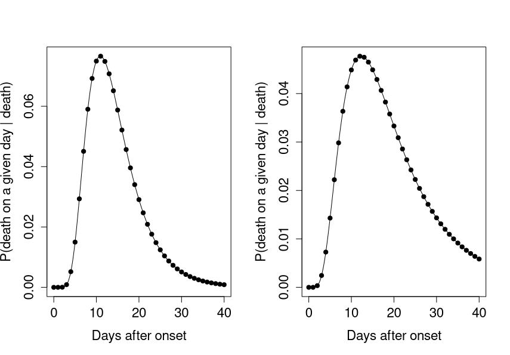
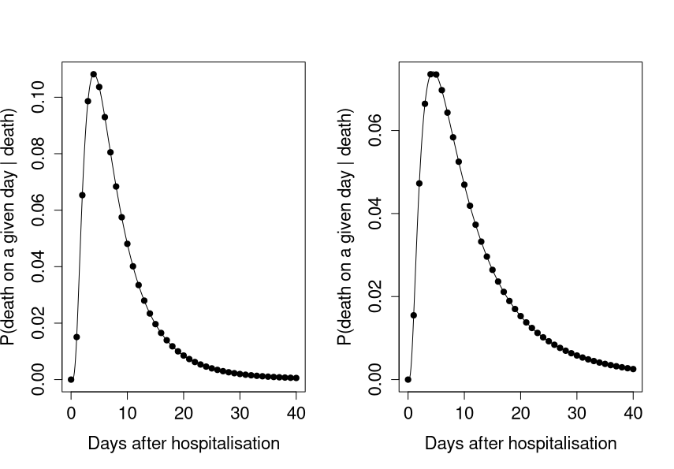
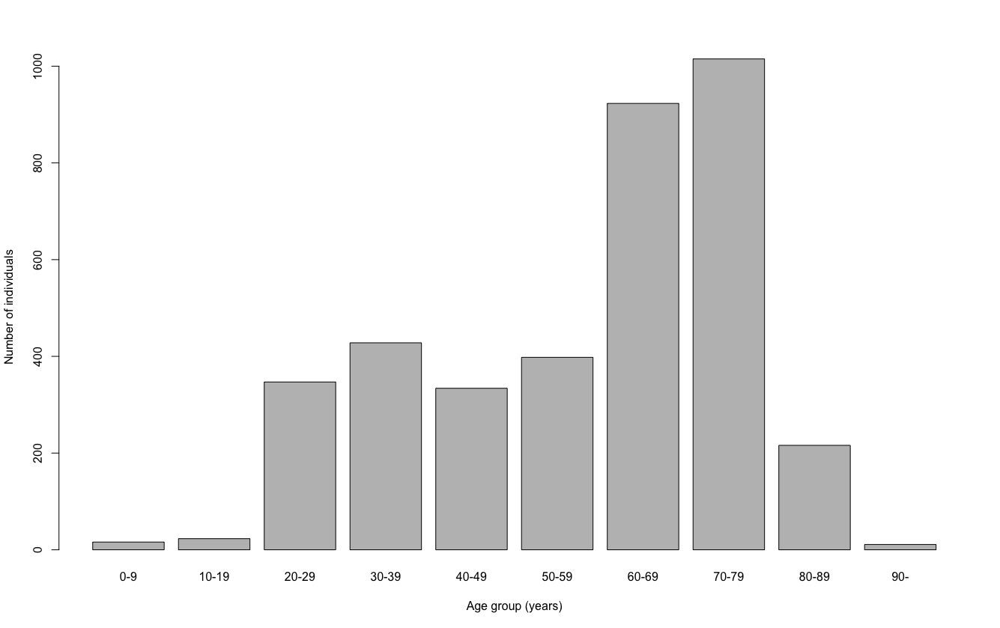

```{r setup, include=FALSE}
knitr::opts_chunk$set(echo = FALSE)
```

*Contributors: Timothy W. Russell, Yang Lui, Sam Abbott, Christopher I Jarvis, Kevin Van Zandvoort, Joel Hellewell, Amy Gimma, CMMID nCoV working group, Rosalind M Eggo,  W John Edmunds, Adam J Kucharski*

*Note: this is preliminary analysis and has not yet been peer-reviewed.*

## Aim

To accurately estimate the case fatality ratio (CFR) of COVID-19 using multiple available datasets, including the fitted output of [Kucharski et al.](https://www.medrxiv.org/content/10.1101/2020.01.31.20019901v2.full.pdf+html) as a more accurate case incidence data for Wuhan. 

## Key results

### Summary table of most recent cCFR estimates

| Dataset | Date of estimate | cCFR | Distribution |
| ----------- | ----------- | ----------- | ----------- |
| Wuhan data (inferred) | 11th February | 0.248% (0.231%-0.266%) | onset-to-death non-truncated (Figure 1A) |
| Wuhan data (inferred) | 11th February | 0.326% (0.304%-0.349%) | onset-to-death truncated (Figure 1B) |
| International data excluding cruise ship | 27th February | 2.27% (1.28%-3.72%) | hospitalisation-to-death non-truncated (Figure 2A) |
| International data excluding cruise ship | 27th February | 2.89% (1.63%-4.72%) | hospitalisation-to-death truncated (Figure 2B) |
| South Korea data | 27th Feburary | 4.11% (2.21%-6.93%) | hospitalisation-to-death (Figure 2B) |
| South Korea data | 27th Feburary | 5.56% (2.99%-9.31%) | hospitalisation-to-death truncated (Figure 2B) |

### Wuhan Data stratified by age range

| Age Range | cCFR | Distribution |
| ----------- | ----------- | ----------- |
| 0 - 29  | NA | NA |
| 30 - 49 | 0.0248% (0.0180% - 0.0333%) | onset-to-death non-truncated (Figure 1A) |
| 30 - 49 | 0.0296% (0.0215% - 0.0398%) | onset-to-death truncated (Figure 1B) |
| 50 - 59 | 0.0934% (0.0764% - 0.113%)  | onset-to-death non-truncated (Figure 1A) |
| 50 - 59 | 0.111%  (0.0912% - 0.135%)  | onset-to-death truncated (Figure 1B) |
| 60 - 69 | 0.240%  (0.211%  - 0.273%)  | onset-to-death non-truncated (Figure 1A) |
| 60 - 69 | 0.287%  (0.252%  - 0.326%)  | onset-to-death truncated (Figure 1B) |
| 70 - 79 | 0.543%  (0.478%  - 0.613%)  | onset-to-death non-truncated (Figure 1A) |
| 70 - 79 | 0.648%  (0.571%  - 0.733%)  | onset-to-death truncated (Figure 1B) |
| 80 -    | 0.904%  (0.774%  - 1.050%)  | onset-to-death non-truncated (Figure 1A) |
| 80 -    | 1.080%  (0.924%  - 1.250%)  | onset-to-death truncated (Figure 1B) |


### Diamond Princess Cruise Ship data

| Age Range | cIFR | cCFR | Distribution |
| ----------- | ----------- | ----------- | ----------- |
| All ages combined | 0.909% (0.11% - 4.26%) | 1.85% (0.601% - 4.282%) | hospitalisation-to-death non-truncated (Figure 2A) |
| All ages combined |1.18% (0.383% - 2.72%) | 2.30% (0.746% - 5.295%) | hospitalisation-to-death truncated (Figure 2B) |

It was only possible to scale the estimates by age group for individuals in the group 80-89, as this was the only group with any deaths. 

| Age Range | cIFR | cCFR | Distribution |
| ----------- | ----------- | ----------- | ----------- |
| 80 - 89 | 11.1%  (3.71% - 24.1%) | 21.6% (7.22% - 46.9%) | hospitalisation-to-death non-truncated (Figure 1B) |
| 80 - 89 | 13.9%  (4.67% - 29.5%) | 27.1% (9.09% - 57.42%) | hospitalisation-to-death truncated (Figure 1B) |


### Table of crude upper bound estimates

We find crude upper bounds for countries without any deaths yet, by finding the total number of recovered individuals and using the rule of three. These estimates are crude approximations and are only within the right area if enough individuals have recovered. Therefore, outside of Singapore where 58 individuals have recovered, we sum up the recovered individuals to get these estimates.

| Country | Recovered | Crude upper bound |
| ----------- | ----------- | ----------- | 
| Singapore | 58 | 5.17% |
| All countries (without singapore) | 117 | 2.564% |
| All countries | 175 | 1.71% |

```{r fig_distribution_onset, echo=FALSE, fig.align='center', fig.cap="_Figure 1: Delay distributions of onset-to-death in cases with fatal outcomes - both taken from Linton et al. A). Non-truncated distribution, mean of 14.5 days and SD of 6.7 days. B). Right-truncated distribution of onset-to-death, mean of 20.2 days and SD of 11.6 days_", out.width = '80%'}

```

```{r fig_distribution_hosp, echo=FALSE, fig.align='center', fig.cap="_Figure 2: Delay distributions of hospitalisation-to-death in cases with fatal outcomes - both taken from Linton et al. A). Non-truncated distribution, mean of 8.6 days and SD of 6.7 days. B). Right-truncated distribution of onset-to-death, mean of 13 days and SD of 12.7 days_", out.width = '80%'}

```

### Age distribution on cruise ship

We plot the distribution of ages on the Diamond Princess cruise ship taken from [this paper](https://www.niid.go.jp/niid/en/2019-ncov-e/9417-covid-dp-fe-02.html). We use this age distribution to calculate age stratified cCFR estimates.


```{r fig_distribution_ages, echo=FALSE, fig.align='center', fig.cap="_Figure 3: The age distribution of individuals on the Diamond Princess cruise ship._", out.width = '80%'}

```

## Methods summary

• We correct for the inherent biases in the estimation of the case fatality ratio when it is calculated within an ongoing epidemic. There will be a much higher number of known outcomes (deaths and recovered individuals) that there are at present and it is possible to use known delay distributions to account for this. 

• To correct for this, we use the [corrected CFR](https://journals.plos.org/plosone/article?id=10.1371/journal.pone.0006852) - equation (6) - which scales the CFR estimate by accounting for outcomes which are unknown at the time in question. This the same method used in our [Ebola letter](https://www.thelancet.com/journals/lancet/article/PIIS0140-6736(14)61706-2/fulltext).

• We perform these corrections on multiple datasets of different types: real death data for Wuhan, [inferred case data](https://www.medrxiv.org/content/10.1101/2020.01.31.20019901v2.full.pdf+html), international data, South Korea data and Diamond Princess cruise ship data. We stratify the results by age where known age distributions for cases and deaths are known.

• The inferred data is used to attempt to correct for reporting biases in Wuhan, as the underlying [model](https://www.medrxiv.org/content/10.1101/2020.01.31.20019901v2.full.pdf+html) fits to multiple datasets.

• However, as the death data is far more reliable, we use the real death time series from within Wuhan within the calculation.

• We use the distributions for confirmation-to-death and onset-to-death taken from [Linton et al. ](https://www.medrxiv.org/content/10.1101/2020.01.26.20018754v1)). They truncate the distributions that they formulate to attempt to counteract the effects of right-censoring, but don't present either as the correct distribution. Therefore, we use both the truncated and non-truncated forms of the distributions and test the sensitivity of the estimates on the distributions.

• We assume a mean of 14.5 days or 20.2 days from onset-to-death (non-truncated and truncated respectively) for COVID-19 ([Linton et al. ](https://www.medrxiv.org/content/10.1101/2020.01.26.20018754v1)). The onset-to-death distribution is shown in Figure 1.

• We assume a mean of 8.6 days or 13 days from hospitalisaton-to-death (non-truncated and truncated respectively) for COVID-19 ([Linton et al. ](https://www.medrxiv.org/content/10.1101/2020.01.26.20018754v1)). The hospitalisation-to-death distribution is shown in Figure 2.


### Detailed methods

• We use the inferred incidence case data from our fitted model of the dynamics of the outbreak in Wuhan (a  short report of the model can be found [here](https://cmmid.github.io/ncov/wuhan_early_dynamics/index.html) and the preprint of the corresponding ful manuscript can be found [here](https://www.medrxiv.org/content/10.1101/2020.01.31.20019901v1)).

• Using this inferred data, we can somewhat account for the biases in the rate of accurate reporting insofar as cases might be under or over reported for various reasons. We do so by fitting an outbreak model to multiple datasets giving more accurate case numbers. Details for how this is achieved in the outbreak model are in the [supplementary material for the preprint](https://www.medrxiv.org/content/10.1101/2020.01.31.20019901v1)).

• For the Wuhan estimates, we use the onset-to-death distribution to calculate the delay.

• For the international estimates, as the data is by date of confirmation, we use the hospitalisation-to-death distribution.

